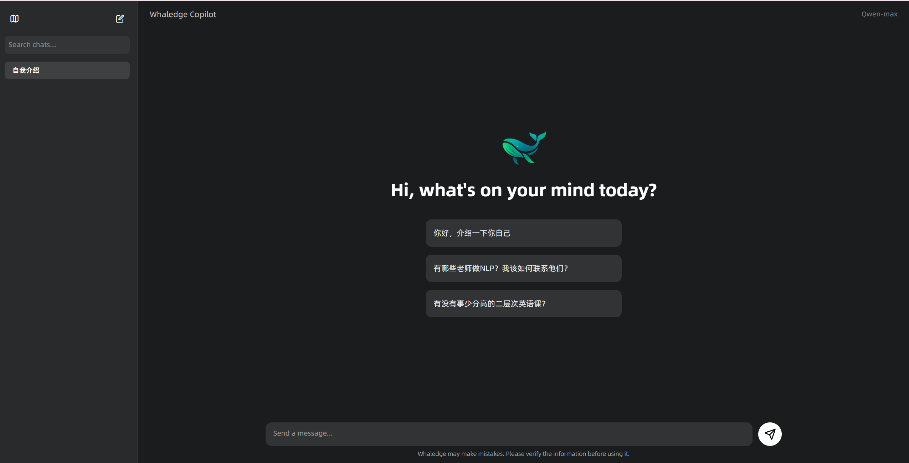

# Whaledge Copilot（迭代二）

## 项目概览

- **优点（项目组织方面）**
  - 使用 uv 进行项目管理 
  - 使用 docker 部署rag项目
  - 使用 docker compose 部署milvus向量数据库
  - 使用jenkins进行cicd
  - 总之就是尽可能是环境配置简单了

- **优点（功能方面）**
  - sse + 消息队列，rag pipeline实时推流
  - rag pipeline易于裁切，调参优化
  - 使用redis做缓存
  - 支持知识库的管理，允许进行查询、以及实时的CRUD

- **技术栈**
  |功能|技术|
  |-- | -|
  |API| fastapi |
  |数据模型校验| pydantic |
  |数据持久化 （对话、用户相关）|sqlite |
  |向量数据持久化 + 向量搜索|milvus |
  |缓存| redis|

- **配置** 
  - 通过环境变量的配置
    - 主要是api_key
  - 通过constants的配置，位于./campus_rag/constants目录下
    - redis url, redis passwd等
  - 其他配置
    - docker.sh里面容器运行的代理配置

- 数据处理脚本只保留了NJU课程爬取部分